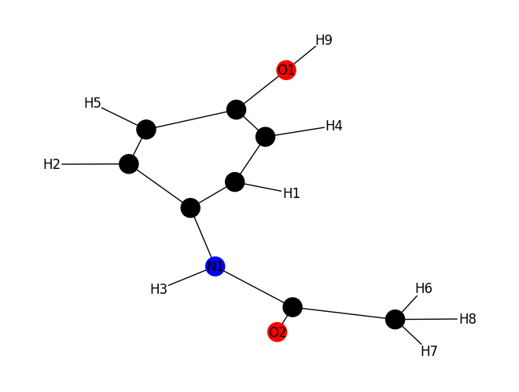

# Substructure Search

The screening of chemical substructures has become the foundation of increasingly popular in silico techniques for augmenting the selection of drug-like compounds for preclinical and clinical development. This Python module focuses on implementing a substructure search that relies on a fingerprint-based agorithm. Additional aspects of the module consist of .sdf processing and graph visualizations. 

Instructions

In order to run the script, the sutructure and substrucure .sdf files must be within the test_compounds directory. 
 
- Build environment
    - ./build_image.sh
 
- Set up environment
    - ./interactive.sh
 
- Change to subdirectory
    - cd src
 
- Run executable
    - python molecule.py -sdf_file {structure_sdf_file} {substructure_sdf_file}

Repository contents

- src
 
    - molecule.py: source code for the substructure screen
 
    - example.ipynb: jupyter notebook demonstrating examples of the substructure screen and visulations
 
    - provided.py: source code for sdf processing 

